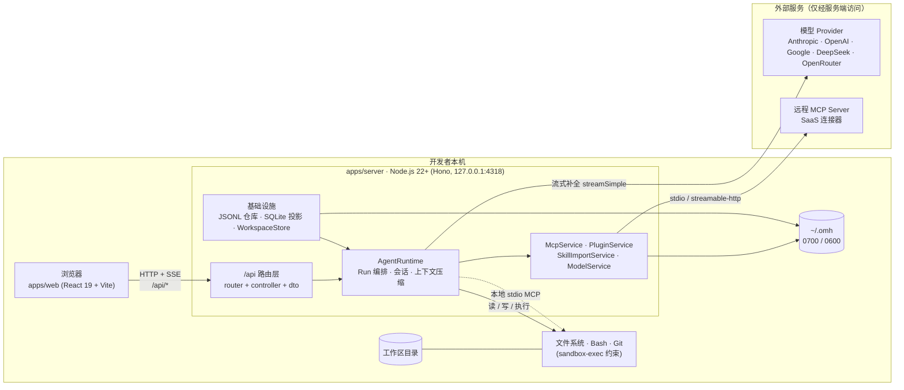
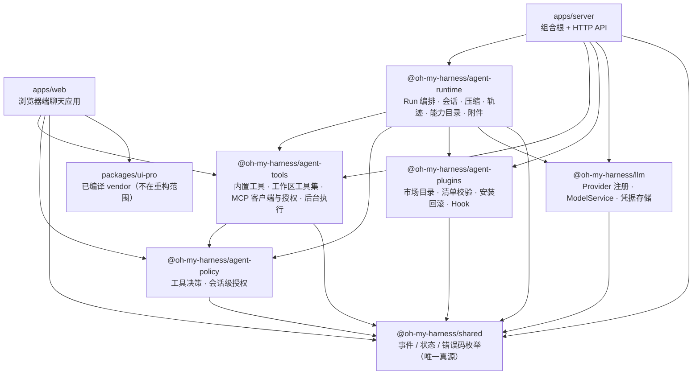
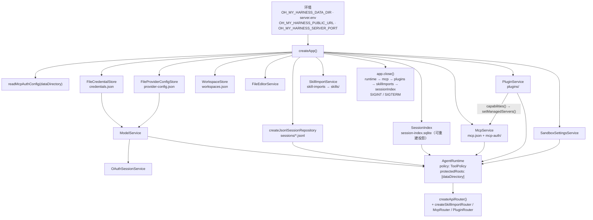
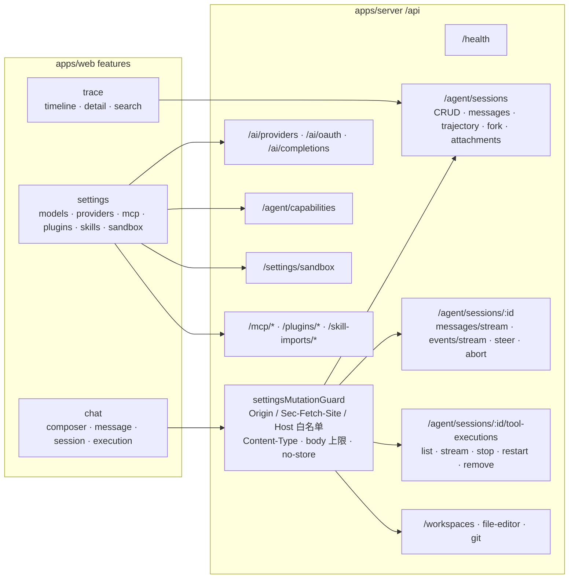
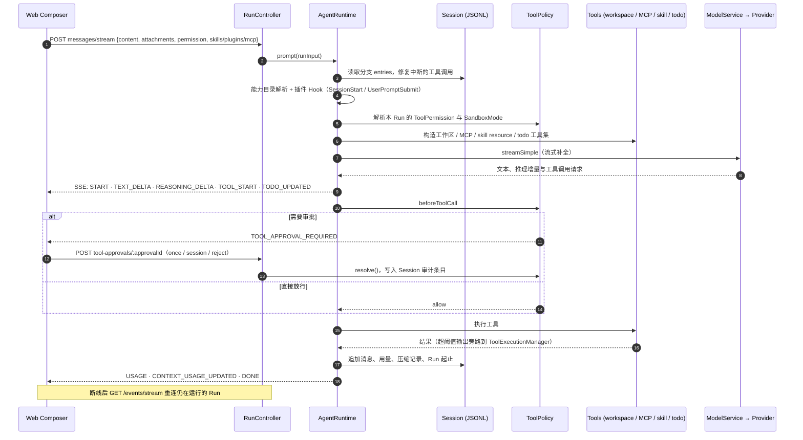
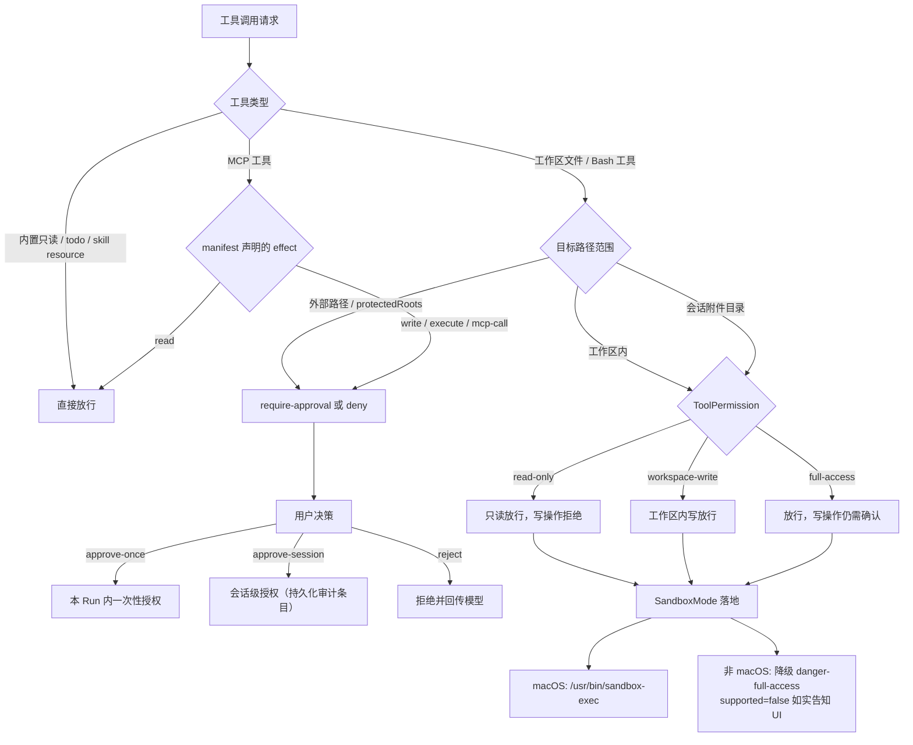
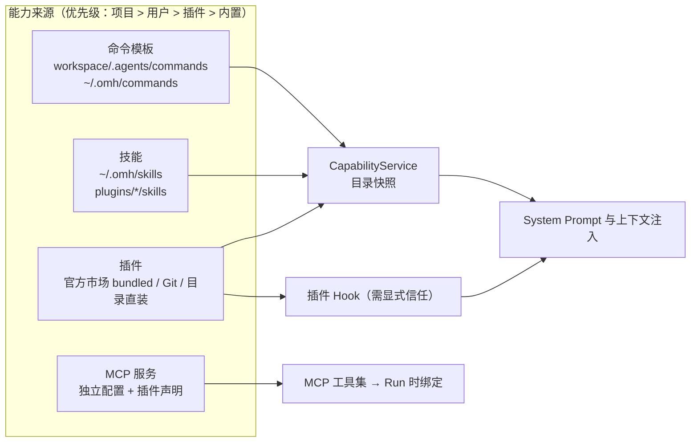
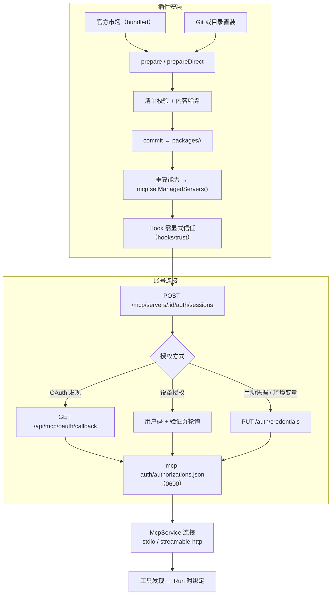
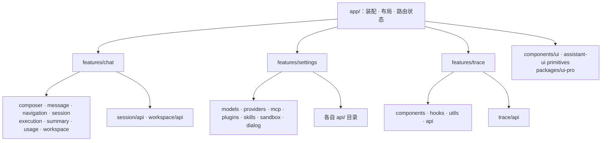

# oh-my-harness 系统架构图

> 依据当前源码（`apps/`、`packages/`）绘制。配套可离线打开的渲染版本见 `docs/architecture.html`。

## 1. 系统总图：本地优先与进程边界



关键边界：

- **密钥不出服务端**：浏览器只持有 HTTP 会话，模型凭据与 OAuth 令牌全部落在 `~/.omh`（目录 `0700`、文件 `0600`）。
- **单进程后端**：Web 仅通过 Vite 代理 `/api → 127.0.0.1:4318` 访问，不存在独立网关或数据库服务。
- **外部依赖只有两类**：模型 Provider 与远程 MCP Server，均由服务端发起。

## 2. 包依赖方向（apps → packages，单向）



## 3. 后端组合根：`createApp()` 装配顺序



## 4. HTTP API 分层与安全边界



## 5. Agent Run 主链路时序



## 6. 权限与沙箱模型



## 7. 能力来源与 `~/.omh` 数据布局



```text
~/.omh/
├── server.env                 # 部署环境（代理、端口、公开回调地址）
├── credentials.json           # 模型 Provider 凭据（API Key / OAuth）
├── provider-config.json       # Provider 与已选模型
├── workspaces.json            # 注册的工作区
├── file-editor.json           # 默认编辑器
├── sandbox-settings.json      # 沙箱模式
├── session-index.sqlite       # 会话列表投影（可从 JSONL 重建）
├── sessions/*.jsonl           # 会话真相源（消息 + custom 审计条目）
├── attachments/<sessionId>/   # 会话附件
├── skills/ · commands/        # 用户级能力
├── skill-imports/             # 技能导入暂存
├── mcp.json                   # MCP 服务配置
├── mcp-auth/
│   ├── providers.json         # 管理员维护的授权端点（插件不可覆盖）
│   ├── clients.json           # 预注册 Client ID / Secret
│   └── authorizations.json    # 运行时令牌，勿手工编辑
└── plugins/
    ├── state.json · packages/ · data/ · staging/ · catalog-cache/
```

## 8. 插件安装与 MCP 授权



## 9. 前端分层



## 10. 设计取舍速查

| 决策 | 理由 |
| --- | --- |
| 本地优先，密钥只在服务端 | 凭据不进浏览器与分发包；OAuth 回调固定在本地公开地址 |
| JSONL 为会话真相源，SQLite 仅投影 | 可读、可恢复、可审计；投影可随时重建 |
| 显式 `createApp()` 依赖注入 | 单一组合根，服务可替换为测试替身 |
| 事件协议集中在 `packages/shared` | 前后端共用枚举，避免定义漂移 |
| 工具输出溢出到独立执行日志 | 上下文可控，长任务仍可后台运行 |
| 授权与启用解耦，写操作不自动重放 | 用户意图 ≠ 长期授权 |
| 模拟状态必须可区分 | 未连接的服务不得呈现为已连接 |
